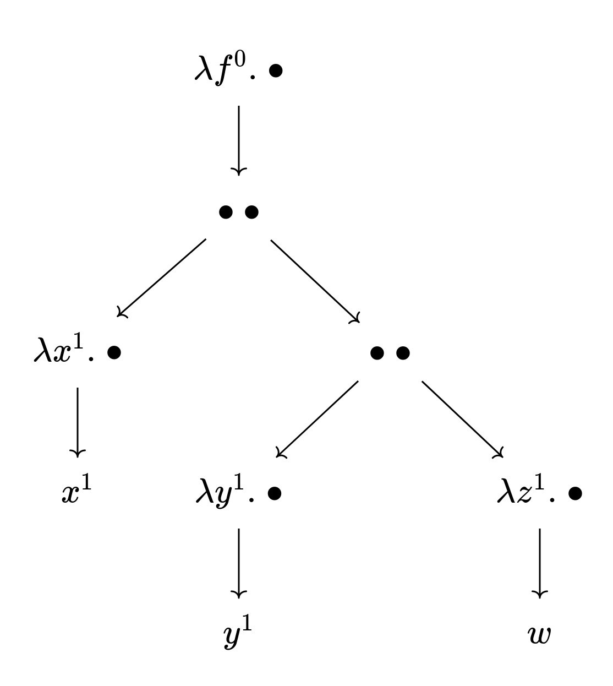
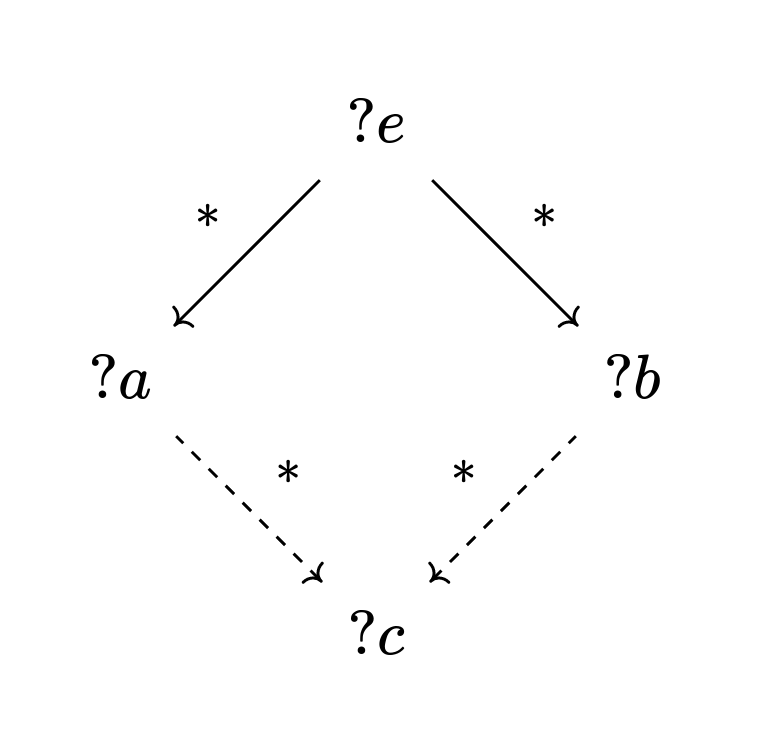
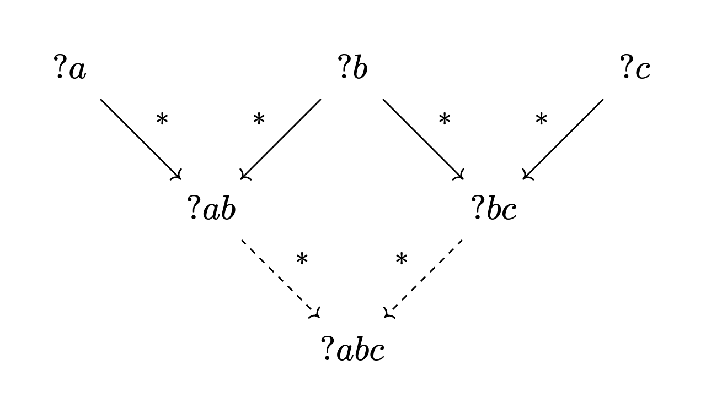

# Исчисление выражений

---

# Функции

---

В школьной математике они определялись правилами вида

$$l(x) := 3x - 2$$

И вычислислялись с помощью подстановки:

$$\begin{aligned}
l(1) &= 3 - 2 = 1 \\
l(5) &= 15 - 2 = 13
\end{aligned}$$

Функции, вычисляемые с помощью подстановки, станут нашим основным инструментом.

---

Но сначала нужно отделить вычисление от равенства.

Запись ${?e_1} \xrightarrow{*} {?e_2}$ означает, что результатом применения нуля или более числа шагов вычисления к ${?e_1}$ является выражение ${?e_2}$.

Пример:

$$l(3) \xrightarrow{*} 3\cdot3 - 2 \xrightarrow{*} 9 - 2 \xrightarrow{*} 7$$

Знак вычисления — метасимвол, не являющийся частью выражения.

---

Отделив вычисление от равенства, мы может рассматривать равенство как высказывание, которое может быть как истиным, так и ложным.

Например, $1=1$ это истинное высказывание, когда же $2=3$ — ложное высказывание.

Как и остальные выражения, равенства можно вычислять:

$$(2\cdot 3 = 7-1) \xrightarrow{*} (6 = 7-1) \xrightarrow{*} (6=6)$$

---

То, что равенство это выражение, позволяет сопоставить каждому уравнению функцию, которая подставляет значения в уравнение.

Например, для уравнения $x^2 - 3x + 2 = 0$ такой функцией будет
$$eq(x) := (x^2 - 3x + 2 = 0)$$

---

Применяя $eq$ к различным значениям $x$, получаем различные высказывания. Некоторые из них являются истиными:

$$eq(1) \xrightarrow{*} (1 - 3 + 2 = 0) \xrightarrow{*} (0 = 0) \\
eq(2) \xrightarrow{*} (4 - 6 + 2 = 0) \xrightarrow{*} (0 = 0)$$

Остальные — ложными:

$$\begin{aligned}
eq(0) &\xrightarrow{*} (2 = 0) \\
eq(3) &\xrightarrow{*} (9 - 9 + 2 = 0) \xrightarrow{*} (2=0)
\end{aligned}$$

Значение $x$ является решением уравнения $eq$ в том случае, когда высказывание $eq(x)$ истино.

---

Тождества отличаются от уравнений тем, что они истины для всех возможных аргументов.

Например, возьмём коммутативность сложения:

$$comm(x,y) := (x+y = y+x)$$

Значение функции $comm$ истино для всех числовых значений $x$ и $y$.

---

Подстановка называется вычислением не просто так — с помощью функций можно выражать и алгоритмы, в том числе и арифметические операции.

Основная идея — свести задачу к той же задаче, но с другимы данными.

---

Рассмотрим сложение чисел используя камешки. Пусть есть два мешка — в левом три камня, когда же в правом — два. Мы хотим найти сумму этих камней:

$$\{\bullet{\bullet}\bullet\} + \{\bullet\bullet\}$$

Переложив камешек из правого мешка в левый, получаем другую задачу:

$$\{\bullet{\bullet}{\bullet}\bullet\} + \{\bullet\}$$

Переложив ещё один, получаем:

$$\{\bullet{\bullet}{\bullet}{\bullet}\bullet\} + \{\}$$

И здесь мы уже знаем ответ: $\{\bullet{\bullet}{\bullet}{\bullet}\bullet\}$.

---

Символьно же, мы выражаем натуральные числа следующим образом:

$$\begin{aligned}
&0 & &1 & &2 & &3 & &\dots \\
&z & &s(z) & &s(s(z)) & &s(s(s(z))) & &\dots
\end{aligned}$$

Константа $z$ означает нуль, когда же $s(n)$ означает число, которое непосредственно следует за числом $n$.

$s$ можно рассматривать как функцию — но мы её не вычисляем, а используем выражение буквально.

---

Функцию $(+)(n, k)$ можно опредеить как

$$\begin{aligned}
n + z  &:= n \\
n + s(k)  &:= s(n) + k
\end{aligned}$$

Функция $(+)$ использует саму себя в своём определении. Такие функции называются *рекурсивными*, а непосредственно ссылка функции на себя — *рекурсией*.

---

Вычислим $3+2$, используя данное нами определение сложение:

$$\begin{aligned}
    s(s(s(0)))   + s(s(0)) &\xrightarrow{*}  s(s(s(s(0))))  +   s(0) \\
  &\xrightarrow{*} s(s(s(s(s(0))))) +     0 \\
  &\xrightarrow{*} s(s(s(s(s(0)))))
\end{aligned}$$

Не самый эффективный способ складывать числа, но как пример сойдёт.

---

Но вычислять можно не только равенства и числа, но даже сами функции. Для этого введём понятие анонимной функции.

Анонимная функция, которая сопоставляет числу его квадрат пишется так:

$$λn.\; n^2$$

И применяется точно так же, как и обычная функция:

$$(λn.\; n^2)(3) \xrightarrow{*} 3^2 \xrightarrow{*} 9$$

---

Определим функцию $add$, результатом которой является функция, которая прибавляет число:

$$add(n) := λk.\;n+k$$

С её помощью можно сложить два числа:

$$add(3)(4) \xrightarrow{*} (λk.\; 3+k)(4) \xrightarrow{*}7$$

Любую функцию нескольких аргументов можно представить как функцию одного аргумента, результатом которой является другая функция.

---

# Лямбда-исчисление

---

Лямбда-исчисление это анонимные функции превращённые в формальную систему. Синтаксис:

$$\begin{aligned}
expr ::=\ &var & &\text{(имя переменной)} \\
\mid\quad &“λ” \, var\ “.”\ expr & &\text{(абстракция)} \\
\mid\quad &expr\ expr & &\text{(применение)}
\end{aligned}$$

Имя переменной может содержать более одного символа. Кроме того, мы различаем строчные буквы от заглавных: $ab$ и $aB$ это два разных имени.

Применение левоассоциативно: ${?f}\ {?v_1}\ {?v_2}$ означает $({?f}\ {?v_1})\ {?v_2}$. Кроме того, абстракция захватывает всё, что находится справа её.

---

Ещё мы будем использовать следующее сокращение: 
- $λ{?v_1}\,{?v_2}.\; ?e$ означает $λ{?v_1}.\;(λ{?v_2}.\; {?e})$.
- $λ{?v_1}\,{?v_2}\,{?v_3}.\; ?e$ означает $λ{?v_1}.\;(λ{?v_2}.\; (λ{?v_3}.\;{?e}))$.
- И так далее

Например, $λ x\, y.\; x$ это то же самое, что и $λx.\; λ y.\; x$.

---

Предназначение переменных — указывать места для подстановки. Однако, наличие имён у переменных порождает проблемы.

Например, что означает $λx.\; λx.\; x$?

---

Чтобы сделать имена однозначными, пронумеруем их. Для этого, двигаясь *вниз* по синтаксическому дереву, пронумеруем переменные при абстракция в порядке их появления. При этом переменные нумеруются независимо в каждом пути дерева.

Затем для каждой переменной вне абстракции, двигаясь *вверх* по синтаксическому дереву, ищем ближайшую абстракцию, в которой переменная имеет то же имя. Если такая такая абстракция нашлась, то нумеруем изначальную переменную соответствующим номером.

---

Пронумеровав $λx.\; λx.\; x$, получаем $λx^0.\; λx^1.\; x^1$. Здесь явно видно, что переменная $x$ связана с внутренней абстракцией, а не с внешней.

Другой пример. Рассмотрим выражение

$$λf.\; (λx.\; x)\ (λy.\; y)\ (λz.\; w)$$

Пронумерованное выражение имеет вид

$$λf^0.\; (λx^1.\; x^1)\ (λy^1.\; y^1)\ (λz^1.\; w)$$

Следующий слайд показывает синтаксическое дерево этого выражения.

---

---

Классификация переменных в пронумерованном выражении:

1. Вхождение переменнй при абстракции называется связывающим
2. Вхождения пронумерованных переменных называются связанными
3. Вхождения переменных без номеров называются свободными

Связанные вхождения указывают места для подстановки значений, когда же свободные переменные можно рассматривать как внешние определения.

---

Номера сами по себе однозначно указывают места подстановки. Заменив связанные вхождения на номера и удалив связывающие вхождения, получаем локально безымянное предствление.

Вот несколько выражений в локально безымянном предствлении:

$$\begin{aligned}
&λx.\;x &\qquad &λ.\; \underline 0 \\
&λx.\;λy.\;y & &λ.\; λ.\ \underline 1 \\
&(λx.\;λy.\; y\ x)\ z & &(λ.\;λ.\; \underline 1\ \underline 0)\ z
\end{aligned}$$

---

Выражения $?e_1$ и $?e_2$ называются альфа-эквивалентными (пишется $?e_1 \equiv_α {?e_2}$), если их локально безымянные формы совпадает.

Альфа-эквивалентность выражает то, что смысл выражения не зависит от имён связанных переменных: например, $λx.\;x$ и $λt.\;t$ это по сути одно и то же выражение.

Далее, мы будем считать альфа-эквивалентные выражения одним и тем же выражением.

---

Если свободная переменная это внешнее определение, то можно подставить значение на её место.

$?e[?x := {?v}]$ это выражение, где каждое свободное вхождение переменной $?x$ заменено на выражение $?v$.

Например, результатом $(λx.\; I\ I\ x)[I := λt.\; t]$ будет $λx.\; (λt.\;t)\ (λt.\;t)\ x$.

---

Но есть тонкость:

- $(λx.\; f\ x)[f := z]$ это $λx^0.\; z\ x^0$, где $z$ — свободная переменная
- Но если наивно подставить $f := z$ в $λz. f\ z$, то результатом будет $λz^0.\; z^0\ z^0$, где $z$ оказалась связана

Поэтому, подстановка должна давать новые имена связанным переменным, чьи имена совпадают с именами свободных переменных в подставляемом выражении.

И результатом $(λz.\; f\ z)[f := z]$ будет выражениие, где связанная переменная $z$ имеет другое имя — например, $λt.\; z\ t$.

---

С помощью подстановки можно сформулировать правила вычисления лямбда-выражений:

$$\begin{aligned}
(λ?x.\;?e)\ ?v &\longrightarrow_β {?e}[{?x := {?v}}] & \text{(бета-редукция)} \\
(λ?x.\; {?f}\ {?x}) &\longrightarrow_η {?f} & \text{(эта-редукция)}
\end{aligned}$$

Применение правила это замена подвыражения (редекса), соответствующего левой части правила, выражением в правой части правила.

Эта-редукция применима только в том случае, когда в $?f$ нет свободных вхождений переменной $?x$.

---

Мы пишем $?e_1 ⟶ ?e_2$, если применение бета- или эта-редукции к $?e_1$ даёт выражение $?e_2$.

Мы пишем ${?e_1} \xrightarrow{*} {?e_2}$, если применение конечного числа (включая нуль)
редукций к выражению $?e_1$ даёт выражение $?e_2$.

Правила вычисления не говорят, какой именно редекс заменяется, и потому одно и то же выражение можно вычислять по разному:

$$\begin{aligned}
(λx\,y.\; x)\ ((λx.\;x)\ z) &⟶ λy.\; ((λx.\;x)\ z) &⟶ λy.\;z \\
(λx\,y.\; x)\ ((λx.\;x)\ z) &⟶ (λx\,y.\; x)\ z &⟶ λy.\;z
\end{aligned}$$

---

Несмотря на то, что вычислять можно по разному, всегда есть возможность придти к одному и тому же результату.

**Теорема (Чёрч — Россер):** Пусть $?e \xrightarrow{*} {?a}$ и $?e \xrightarrow{*} {?b}$. Тогда существует такое выражение $?c$, что $?a \xrightarrow{*} {?с}$ и $?b \xrightarrow{*} {?c}$.

Это важнейшая теорема лямбда-исчисления. Но доказывать мы её не будем.

Утверждение теоремы можно изобразить диаграммой.

---

---

Выражение $?a$ вычислительно равно выражению $?b$ (пишется $?a \equiv {?b}$), если существует такое выражение $?c$, что $?a \xrightarrow{*} {?c}$ и $?b \xrightarrow{*} {?c}$.

Вычислительное равенство удволетворяет основным свойствам равенства:

- $?e ≡ {?e}$
- Если $?a \equiv {?b}$, то ${?b} \equiv {?a}$
- Если ${?a} ≡ {?b}$ и ${?b} ≡ {?c}$, то ${?a} ≡ {?c}$

Первые два свойства следуют непосредственно из определения. Последнее же следует из теоремы Чёрча — Россера, что проще всего показать диаграммой.

---

---

Выражение $?n$ находится в нормальной форме, если к нему невозможно применить правило вычисления.

Говорят, что $?n$ является нормальной формой выражения $?e$, если $?n$ находится в нормальной форме и  ${?e} \xrightarrow{*} {?n}$.

Из теоремы Чёрча — Россера следует, что у выражения может быть только одна нормальная форма. Кроме того, если два выражения имеют одну и ту же нормальную форму, то они вычислительно равны.

---

Не каждое выражение имеет нормальную форму:

$$\begin{aligned}
(λx.\;x\ x)\ (λx.\;x\ x) &⟶ (λx.\;x\ x)\ (λx.\;x\ x) &⟶ \dots \\
(λx.\;x\ x\ x)\ (λx.\;x\ x\ x) &⟶ (λx.\;x\ x\ x)\ (λx.\;x\ x\ x)\ (λx.\;x\ x\ x) &⟶ \dots
\end{aligned}$$

И даже если у выражения есть нормальная форма, не каждая стратегия вычисления к ней приводит:

$$\begin{aligned}
(λx\,y.\; y)\ ((λx.\;x\ x)\ (λx.\;x\ x)) &⟶ (λx\,y.\; y)\ ((λx.\;x\ x)\ (λx.\;x\ x)) &⟶ \dots \\
(λx\,y.\; y)\ ((λx.\;x\ x)\ (λx.\;x\ x)) &⟶ λy.\;y
\end{aligned}$$

Хотя теорема Чёрча — Россера гарантирует, что всегда есть способ достигнуть нормальной формы, она не заставляет ему следовать.

---
